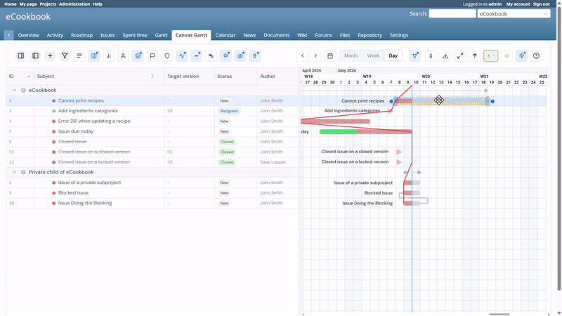

<div align="center">

# Redmine Canvas Gantt

Redmine 向けの高性能 Canvas ガントチャートプラグイン。

Listed on Redmine Plugins Directory:
https://www.redmine.org/plugins/redmine_canvas_gantt

[](LICENSE)
[](https://github.com/tiohsa/redmine_canvas_gantt/actions/workflows/ci.yml)
[](https://github.com/tiohsa/redmine_canvas_gantt/releases)
[](#requirements)
[](#requirements)
[](#requirements)

[English README](README.md) · [Releases](https://github.com/tiohsa/redmine_canvas_gantt/releases) · [Issues](https://github.com/tiohsa/redmine_canvas_gantt/issues)

</div>

---

## Overview

Redmine Canvas Gantt は、タイムラインを HTML5 Canvas で描画しつつ左側のサイドバーを直接編集できる、Redmine 向けの高速なガントチャートプラグインです。標準の Redmine ガントが見づらい、または重くなりやすいプロジェクト向けに設計されています。

## Features

- Canvas ベースの高速描画による滑らかなスクロールとズーム
- タスクの移動、期間変更、端点ドラッグによる依存関係作成
- 依存関係の作成、更新、削除に対応
- 件名、担当者、ステータス、進捗率、期日、カスタムフィールドのインライン編集
- サイドバーでのドラッグアンドドロップによる親子関係の変更
- 複数行入力による子チケット一括作成
- フィルタ結果単位または project 全体で保存できるベースライン比較
- プロジェクト、担当者、ステータス、バージョン、題名によるフィルタとグループ化
- 保存済みクエリ選択時の表示列・ソート順の同期
- クエリやフィルタが有効な際、ツールバーに視覚的なインジケータ（青いバッジ）を表示
- バージョンヘッダー、進捗ライン、行高プリセット、UI 設定の永続化

## Demo




## Requirements

- Redmine 6.x
- Ruby 3.x
- SPA ビルドおよびフロントエンド開発用に Node.js 20+
- Redmine で REST API が有効化されていること

### Security and impact

- データベースマイグレーション: なし
- 追加パーミッション: `view_canvas_gantt`, `edit_canvas_gantt`
- アンインストール: プラグインディレクトリを削除して Redmine を再起動

## Installation

1. プラグインを Redmine の `plugins/` ディレクトリに配置します。

   ```bash
   cd /path/to/redmine/plugins
   git clone https://github.com/tiohsa/redmine_canvas_gantt.git
   ```

2. Redmine を再起動します。

   配置後にアプリケーションサーバーを再起動してください。

## Usage

1. REST API を有効化します。
   **管理** -> **設定** -> **API** で **REST による Web サービスを有効にする** を有効化します。

2. プロジェクトモジュールを有効化します。
   **プロジェクト** -> **設定** -> **モジュール** で **Canvas Gantt** を有効化します。

3. 権限を付与します。
   **管理** -> **ロールと権限** で `view_canvas_gantt` と `edit_canvas_gantt` を必要に応じて付与します。

4. チャートを開きます。
   プロジェクトメニューの **Canvas Gantt** をクリックします。

5. タスクを操作します。
   - Ctrl/Cmd + マウスホイールまたはツールバーでズーム
   - タスクをドラッグしてタイムライン上で移動
   - タスク端をドラッグして期間変更
   - 端点ドットからドラッグして依存関係を作成
   - 依存関係編集から種別や delay を変更、または削除
   - サイドバーの行を別タスクへドラッグして子チケット化
   - 子チケット一括作成で複数の子チケットをまとめて追加

### ベースライン比較

- ベースラインは比較専用機能であり、スケジューリングや CPM 計算の入力には使いません。
- project ごとに単一のベースライン snapshot を保持し、新しく保存すると既存 snapshot を置き換えます。
- ツールバーから `現在のフィルタ結果` または `project 全体` のどちらを保存するか選べます。
- 保存範囲が `project 全体` でも、画面上の ghost bar と差分表示は現在表示中のタスクに対してのみ行われます。
- ベースラインの閲覧には `view_canvas_gantt`、保存には `edit_canvas_gantt` が必要です。

## 共有ビューとクエリパラメータ

Canvas Gantt では、共有すべき業務条件と個人向けの UI 状態を分離して扱います。

- 共有用の業務条件は URL パラメータと `query_id` から解決されます
- ズーム、スクロール位置、サイドバー幅などの個人的な UI 状態は `localStorage` に保存されます
- 表示列やソート順は、Redmine 標準クエリと同期される共有可能な状態として扱われます
- 表示設定も設定メニューからプロジェクト間で共有できます。共有対象は、ズームレベル、表示モード、チャート位置、進捗ライン、チケットタイトル、階層線、開始日のみ・期日のみタスクの表示、バージョンヘッダー、ベースライン表示、表示列、列順、依存関係に基づいて整理、列幅、サイドバー幅、カスタムズーム倍率、行の高さ、フォントサイズです。
- `query_id` やプロジェクト選択、ステータス、担当者、バージョン、カスタムフィールド条件などの project 固有のクエリ／フィルタ状態は共有しません
- `Canvas Gantt` タブが bare `/canvas_gantt` を開いた場合に限り、共有クエリ条件はそのプロジェクトで最後に使った状態を `localStorage` から復元します
- 同じ共有条件が複数ソースにある場合の優先順位は次の通りです
  URL パラメータ -> 保存済みクエリ (`query_id`) -> project 単位の last-used shared state -> デフォルト値

### クエリ編集の流れ

Canvas Gantt は Redmine 標準のクエリ編集 UI を再実装しません。クエリの作成、編集、保存は Redmine 標準のチケット一覧で行い、Canvas Gantt は保存済みクエリと、対応済みの Redmine 標準 URL パラメータを受け取って表示に反映します。

- Canvas Gantt のツールバーにある **保存済みクエリ** メニューで、現在のプロジェクトで閲覧可能な保存済み Redmine クエリを選べます
- 保存済みクエリを選ぶと `query_id` を適用して Canvas Gantt を再読み込みします
- **保存済みクエリを解除** で `query_id` を外しつつ、現在解決済みの共有フィルタは URL に残せます
- **この条件を保存** で、現在の条件を Redmine 標準のチケット一覧を iframe ダイアログで開いて保存できます
- 同じメニューの **Redmineでクエリ編集** から、標準チケット一覧を現在のタブで開くこともできます
- Redmine 標準の一覧画面でフィルタ条件を調整し、標準の **Save** でクエリを保存します
- 一覧画面の **Canvas Ganttで開く** で、現在のチケット一覧 URL 状態を引き継いだまま Canvas Gantt に戻ります
- 保存済みクエリを表示している場合は、戻り先 URL に `query_id` が含まれます
- 未保存の標準フィルタを表示している場合は、対応している Redmine 標準 filter パラメータをそのまま引き継ぎます

iframe ダイアログが使いにくい環境向けに、**新しいタブで開く** fallback も用意しています。

現在の表示が保存済みクエリそのものと一致している場合は `query_id` だけで十分です。表示列やソート順も保存済みクエリの定義に従って復元されます。保存済みクエリを開いたあとに Canvas Gantt 側で共有条件（フィルタ、列表示、ソート）を追加変更した場合は、ツールバーから Redmine 一覧へ戻る際に `query_id` に加えて Redmine 標準のフィルタおよびカラム指定パラメータも付与し、可能な範囲で同じ表示条件を再現します。

project menu の `Canvas Gantt` タブが shared query なしの bare URL を開いた場合は、その project で最後に使った shared filter 状態を復元し、browser URL も canonical な shared query params に書き換えます。

### 対応している共有パラメータ

| パラメータ            | 説明                                                                  |
| :-------------------- | :-------------------------------------------------------------------- |
| `query_id`            | Redmine の保存済みチケットクエリを基底条件として使用                  |
| `status_ids[]`        | ステータス ID で絞り込み                                              |
| `assigned_to_ids[]`   | 担当者 ID で絞り込み。未割当は `none` を指定                          |
| `project_ids[]`       | 現在のプロジェクト配下で表示対象のプロジェクトを絞り込み              |
| `fixed_version_ids[]` | 対象バージョン ID で絞り込み。未設定は `none` を指定                  |
| `group_by`            | グループ化。`project` または `assigned_to`                            |
| `sort`                | フロントエンドのソートキーと方向。例: `subject:asc`, `startDate:desc` |
| `c[]`                 | 表示する列を指定（Redmine標準互換）。例: `c[]=subject&c[]=status`     |
| `show_subprojects`    | サブプロジェクト非表示設定。`0` で非表示、未指定または `1` で表示     |

### Redmine 標準チケット一覧との互換性

| 項目               | 内容                                                                             |
| :----------------- | :------------------------------------------------------------------------------- |
| **パラメータ**     | `set_filter=1`, `f[]`, `op[field]`, `v[field][]`, `c[]`, `group_by`, `sort`      |
| **対応フィールド** | `status_id`, `assigned_to_id`, `project_id`, `fixed_version_id`, `subproject_id` |
| **対応演算子**     | `=` (等しい), `*` (すべて), `!*` (なし), `o` (未完了), `c` (完了)                |

現在の互換性の制限:

- 未対応の Redmine field / operator は warning を出して無視します
- `assigned_to_id` の「特定担当者 + 未割当」を同時に Redmine 標準 URL へ完全に書き戻すことはできないため、未割当側を省略して warning を出します
- バージョンなしは Canvas 独自 URL では `fixed_version_ids[]=none` で表現できますが、Redmine 標準の一覧 URL へ戻すときは省略されます
- 既定ソート (`startDate:asc`) は Redmine 一覧 URL へ戻すときに省略されることがあります

### URL 例

保存済みクエリを基底にして開く:

```text
/projects/demo/canvas_gantt?query_id=12
```

保存済みクエリにステータスと担当者条件を上書きする:

```text
/projects/demo/canvas_gantt?query_id=12&status_ids[]=1&status_ids[]=2&assigned_to_ids[]=5
```

対応済みの Redmine 標準チケット一覧 URL から直接 Canvas Gantt を開く:

```text
/projects/demo/canvas_gantt?query_id=12&set_filter=1&f[]=status_id&op[status_id]==&v[status_id][]=1&group_by=assigned_to&sort=start_date:desc
```

ブラウザ保存状態に依存せず、特定プロジェクト・特定バージョンの共有ビューを開く:

```text
/projects/demo/canvas_gantt?project_ids[]=3&fixed_version_ids[]=7&group_by=project&sort=startDate:asc
```

サブプロジェクトを隠し、未割当チケットだけを表示する:

```text
/projects/demo/canvas_gantt?assigned_to_ids[]=none&show_subprojects=0
```

## Configuration

**管理** -> **プラグイン** -> **Canvas Gantt** -> **設定** から設定します。

- **インライン編集切替**: `subject`, `assigned_to`, `status`, `done_ratio`, `due_date`, `custom_fields`
- `row_height`: デフォルト行高
- `use_vite_dev_server`: 開発時に `http://localhost:5173` のフロントエンド資産を利用

### Compatibility note

`redmica_ui_extension` による Select2 の挙動が Canvas Gantt の操作に干渉する場合は、**管理** -> **プラグイン** -> **Redmica UI Extension** -> **設定** で検索可能セレクトボックスを無効化してください。

## Docker Quick Start

このリポジトリには、Redmine 6.0 と MariaDB をローカルで起動するための `docker-compose.yml` が含まれています。

### スタックを起動

```bash
docker compose up -d --wait
```

[http://localhost:3000](http://localhost:3000) で Redmine を開けます。

### 初期データを投入

```bash
docker compose exec -T -e REDMINE_LANG=ja redmine bundle exec rake redmine:load_default_data
docker compose exec -T redmine bundle exec rake db:fixtures:load
```

### プロジェクトで Canvas Gantt を有効化

1. 対象プロジェクトを開きます。
2. **設定** -> **モジュール** を開きます。
3. **Canvas Gantt** を有効化します。
4. 編集が必要な場合は、利用ロールに `view_canvas_gantt` と `edit_canvas_gantt` を付与します。

### スタックを停止

```bash
docker compose down
```

## Development

SPA フロントエンドは `spa/` にあります。

```bash
cd spa
npm ci
npm run build
npm run lint
npm run test -- --run
```

フロントエンドをライブ開発する場合:

```bash
cd spa
npm run dev
```

その後、プラグイン設定で `use_vite_dev_server` を有効化してください。

### Redmine integration tests

`spa/` から Redmine 連携の Playwright テストを実行できます。

```bash
npx playwright test -c playwright.redmine.config.ts
```

## Release

`v*` に一致するタグを push すると、GitHub Release が自動作成されます。

```bash
git tag vX.Y.Z
git push origin vX.Y.Z
```

リリース workflow は生成ノート付きの GitHub Release を作成するだけです。SPA のビルドや拡張機能アーティファクトのパッケージングは行いません。

## Build Output

- `npm run build` の出力先は `assets/build/`
- Redmine 起動時に、それらのファイルは `public/plugin_assets/redmine_canvas_gantt/build` へリンクまたはコピーされます
- フォールバック資産ルート `/plugin_assets/redmine_canvas_gantt/build/*` も利用できます

## License

GNU General Public License v2.0 (GPL v2). 詳細は [LICENSE](LICENSE) を参照してください。
